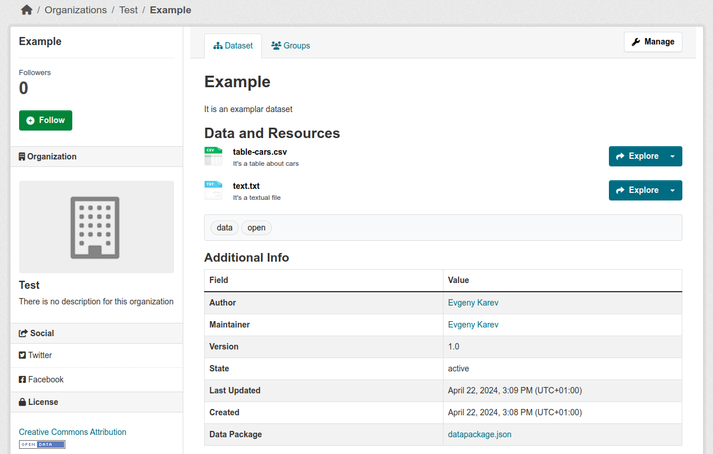

# ckanext-datapackage

[](https://github.com/frictionlessdata/ckanext-datapackage/actions)
[](https://codecov.io/gh/frictionlessdata/ckanext-datapackage)
[](https://github.com/frictionlessdata/ckanext-datapackage)
[](https://pypi.python.org/pypi/ckanext-datapackage)

Data Package integreation for CKAN.

## Purpose

This lightweight CKAN plugin adds a `dataset/<id>/datapackage.json` endpoint to every dataset in the data catalog. Read more about the [Data Package Standard](https://datapackage.org/).

## Requirements

The extension requires Python 3.8+. It is being developed and tested with CKAN 2.10. Please fill an issue if it doesn't work as expected with other versions.

## Installation

1.  Install the extension:

```bash
$ pip install ckanext-datapackage
```

2.  Enable the plugin in your ini file:

```text
ckan.plugins = ... datapackage
```

## Endpoint

Data Package representations of a particular dataset can be accessed using the following endpoint:

```
https://{ckan-instance-host}/dataset/{dataset-id}/datapackage.json
```

Read more about [Data Package Standard](https://datapackage.org/) specifications and `datapackage.json` metadata format.

## Example

Consider there is a dataset as below:

> http://ckan:5000/dataset/example



The Data Package representation of this dataset can be accessed using the following endpoint (note that the link is also available on the dataset page in the "Additional Info" section):

> http://ckan:5000/dataset/example/datapackage.json

```json
{
  "$schema": "https://datapackage.org/profiles/2.0/datapackage.json",
  "ckan:id": "8bb0257b-37be-48ca-9129-59040264acd5",
  "contributors": [
    {
      "email": "eskarev@gmail.com",
      "roles": ["author"],
      "title": "Evgeny Karev"
    },
    {
      "email": "eskarev@gmail.com",
      "roles": ["maintainer"],
      "title": "Evgeny Karev"
    }
  ],
  "created": "2024-04-22T14:08:29.297417",
  "description": "It is an examplar dataset",
  "keywords": ["data", "open"],
  "licenses": [
    {
      "name": "cc-by",
      "path": "http://www.opendefinition.org/licenses/cc-by",
      "title": "Creative Commons Attribution"
    }
  ],
  "name": "example",
  "resources": [
    {
      "bytes": 1497,
      "ckan:id": "03eec88c-a4b0-4ba9-8940-58dd4d383936",
      "description": "It's a table about cars",
      "format": "csv",
      "mediatype": "text/csv",
      "name": "table_cars",
      "path": "http://ckan:5000/dataset/8bb0257b-37be-48ca-9129-59040264acd5/resource/03eec88c-a4b0-4ba9-8940-58dd4d383936/download/table-cars.csv",
      "schema": {
        "fields": [
          {
            "name": "brand",
            "type": "string"
          },
          {
            "name": "model",
            "type": "string"
          },
          {
            "name": "price",
            "type": "number"
          },
          {
            "name": "kmpl",
            "type": "number"
          },
          {
            "name": "bhp",
            "type": "number"
          },
          {
            "name": "type",
            "type": "string"
          }
        ]
      },
      "type": "table"
    },
    {
      "bytes": 13,
      "ckan:id": "f3425eea-0ec9-481e-9679-382e7c499474",
      "description": "It's a textual file",
      "format": "txt",
      "mediatype": "text/plain",
      "name": "text",
      "path": "http://ckan:5000/dataset/8bb0257b-37be-48ca-9129-59040264acd5/resource/f3425eea-0ec9-481e-9679-382e7c499474/download/text.txt"
    }
  ],
  "title": "Example",
  "version": "1.0"
}
```

## Benefits

Having a Data Package representation of a dataset allows for using a rich ecosystem of tools and libraries that support the [Data Package Standard](https://datapackage.org/). For example, data portal users can use the [frictionless-r](https://docs.ropensci.org/frictionless/) or [frictionless-py](https://framework.frictionlessdata.io/docs/console/overview.html) to access the data without loosing metadata and information about data types:

```bash
frictionless extract http://ckan:5000/dataset/example/datapackage.json
```

```text
────────────────────────────────────────────────────────────── Dataset ──────────────────────────────────────────────────────────────
┏━━━━━━━━━━━━┳━━━━━━━┳━━━━━━━━━━━━━━━━━━━━━━━━━━━━━━━━━━━━━━━━━━━━━━━━━━━━━━━━━━━━━━━━━━━━━━━━━━━━━━━━━━━━━━━━━━━━━━━━━━━━━━━━━━━━━━┓
┃ name       ┃ type  ┃ path                                                                                                         ┃
┡━━━━━━━━━━━━╇━━━━━━━╇━━━━━━━━━━━━━━━━━━━━━━━━━━━━━━━━━━━━━━━━━━━━━━━━━━━━━━━━━━━━━━━━━━━━━━━━━━━━━━━━━━━━━━━━━━━━━━━━━━━━━━━━━━━━━━┩
│ table_cars │ table │ http://ckan:5000/dataset/8bb0257b-37be-48ca-9129-59040264acd5/resource/03eec88c-a4b0-4ba9-8940-58dd4d383936… │
│ text       │ text  │ http://ckan:5000/dataset/8bb0257b-37be-48ca-9129-59040264acd5/resource/f3425eea-0ec9-481e-9679-382e7c499474… │
└────────────┴───────┴──────────────────────────────────────────────────────────────────────────────────────────────────────────────┘
────────────────────────────────────────────────────────────── Tables ───────────────────────────────────────────────────────────────
                        table_cars
┏━━━━━━━━━━━━┳━━━━━━━━━━━━━━━┳━━━━━━━┳━━━━━━┳━━━━━┳━━━━━━━┓
┃ brand      ┃ model         ┃ price ┃ kmpl ┃ bhp ┃ type  ┃
┡━━━━━━━━━━━━╇━━━━━━━━━━━━━━━╇━━━━━━━╇━━━━━━╇━━━━━╇━━━━━━━┩
│ Volkswagen │ Vento         │ 785   │ 16.1 │ 104 │ Sedan │
│ Hyundai    │ Verna         │ 774   │ 17.4 │ 106 │ Sedan │
│ Skoda      │ Rapid         │ 756   │ 15   │ 104 │ Sedan │
│ Suzuki     │ Ciaz          │ 725   │ 20.7 │ 91  │ Sedan │
│ Renault    │ Scala         │ 724   │ 16.9 │ 98  │ Sedan │
│ Suzuki     │ SX4           │ 715   │ 16.5 │ 103 │ Sedan │
│ Fiat       │ Linea         │ 700   │ 15.7 │ 112 │ Sedan │
│ Nissan     │ Sunny         │ 699   │ 16.9 │ 98  │ Sedan │
│ Fiat       │ Linea Classic │ 612   │ 14.9 │ 89  │ Sedan │
│ Toyota     │ Etios         │ 603   │ 16.8 │ 89  │ Sedan │
│ ...        │ ...           │ ...   │ ...  │ ... │ ...   │
└────────────┴───────────────┴───────┴──────┴─────┴───────┘
```

Note that remote Data Package support is also under development in [Open Data Editor](https://opendataeditor.okfn.org/).

## Development

Please follow the [Contribution Guide][CONTRIBUTING.md].

## Funding

This project is funded through [NGI0 Entrust](https://nlnet.nl/entrust), a fund established by [NLnet](https://nlnet.nl) with financial support from the European Commission's [Next Generation Internet](https://ngi.eu) program. Learn more at the [NLnet project page](https://nlnet.nl/project/FrictionlessStandards/).

[](https://nlnet.nl)
[](https://nlnet.nl/entrust)
